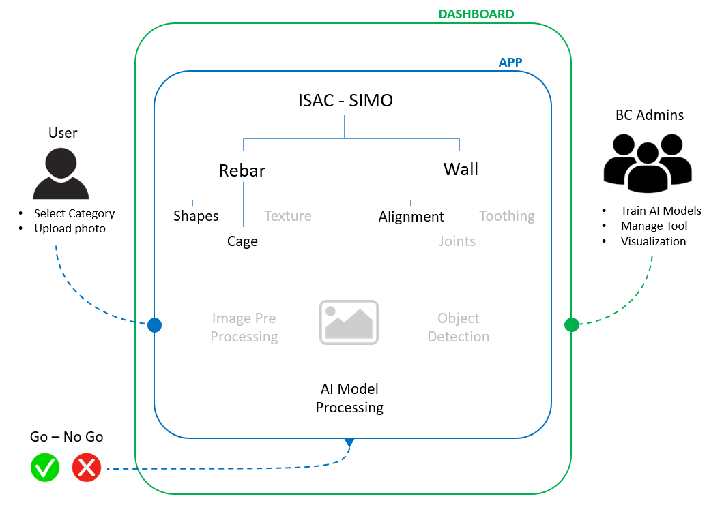
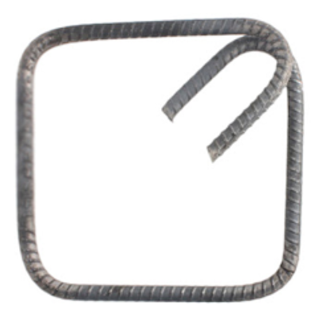
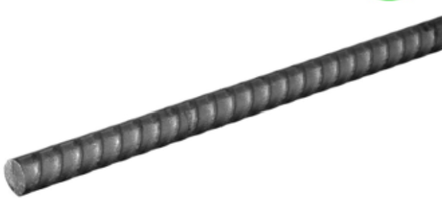
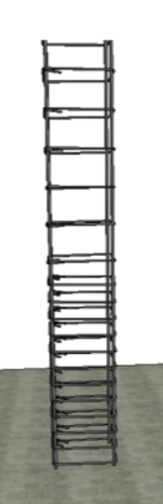
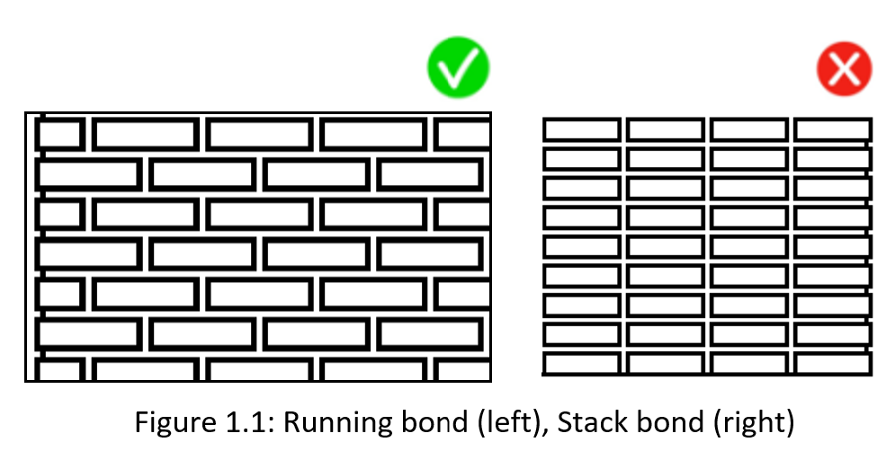
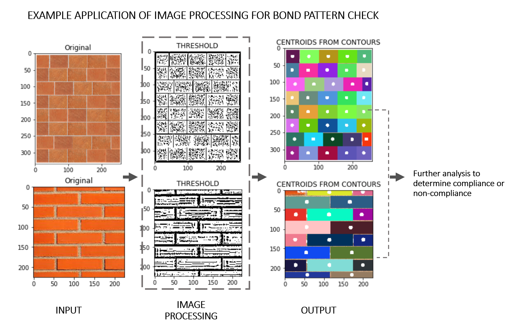

# ISAC SIMO

 

Intelligent Supervision Assistant for Construction - Sistema Inteligente de Monitoreo de Obra

ISAC-SIMO is a system to validate that the intervention work done for homeowners in Colombia has been done correctly and safely. It is a Call for Code with The Linux Foundation created by [Build Change](https://buildchange.org/) and supported by a grant from IBM.

> [View documentation](https://www.isac-simo.net/docs/) at isac-simo.net.

## Related GitHub repos

* [ISAC-SIMO-Django-Backend](https://github.com/ISAC-SIMO/ISAC-SIMO-Django-Backend) - Back end for managing the machine learning model pipeline.
* [ISAC-SIMO-React-Native-App](https://github.com/ISAC-SIMO/ISAC-SIMO-React-Native-App) - This is the end-user facing mobile app for the homeowner.

## Contents

1. [Target users](#target-users)
1. [Project detail](#project-detail)
1. [Project roadmap](#project-roadmap)
1. [Authors](#authors)
1. [License](#license)

## Target users
* Pedro the foreman builder in Colombia is able to receive complete well-specified, high-quality jobs safely and is paid [some percentage] more money and more quickly, which shows that it's worthwhile to do again and again. He is able to choose materials, know how far into a project he is, know when he will be paid, and understand the level of homeowner satisfaction so that he can take corrective action.

* Maria the homeowner is notified by FINDETER that her home needs an intervention in a timely manner, is able to receive a clear proposal of the work to be done within two days, to agree to the work, and to provide her input on the work. She is able to monitor the progress of the work [digitally or some other manner], provide feedback during and after the process, and feel confident that a quality job is done quickly and safely [with the help of a mobile app and AI].

* Juan the inspector is working for FINDETER and is able to ensure the quality and safety of the work done in his community is done at a better cost and in a more efficient manner so that more people get back into safe homes more quickly [some percentage]. He is able to receive notifications when work progresses so that he knows when to review digital documents or visit a site for inspection.

* _Everyone has visibility into the work and notified that's done in order to ensure it's done well, safely, and completely._

## Project detail
The technology consists of a mobile application used by all three roles in order to track the progression of an intervention on a home throughout the process to complete work. The application shows the progress of the work, and it can be validated through the analysis of the quality of two building elements, rebar and walls, by guiding the users through a series of checks. In addition to the mobile application, the tool also consists of a web interface that facilitates the management of checks and image processing pipelines implemented in the mobile application. 

### The architecture

The image below shows an overview of the ISAC-SIMO tool:                                                                           

### Mobile application
The mobile application is used to take photos of rebar and wall installations. With these photos, an assessment can be made as to whether they are compliant (GO) or non-compliant (NO GO). This is powered by machine learning models that have been trained with images of acceptable and unacceptable configurations. In addition, some of the checks deploy computational image processing to extract some quantitative information from an image to determine the "GO" or "NO GO" outcome.

### Checks Implemented
The following checks are planned to be implemented in the rebar and wall categories:
#### Rebar Category
* **Rebar Shapes**: Checks for the shape of transverse rebar elements such as ties and stirrups. An example of a compliant rebar shape is shown below. 

* **Rebar Texture**: Detects the presence or absence of ribs in the rebar, and verifies that the bar does not have any visible corrosion that could affect its quality. An example of a compliant rebar with ribs and without corrosion is shown below.

* **Rebar Cage**: Checks for the correct spacing of transverse rebar elements in columns or beams before concrete is poured. An example of a rebar cage with correct configuration is shown below.

#### Wall Category
* **Brick Alignment / Bond Pattern**: Checks for the bond pattern in walls and a wall's proximity to a running bond or a stack bond as shown below

* **Mortar Joint Thickness**: Checks for compliance based on the relative bed joint thickness (i.e. the thickness of the horizontal layer of mortar upon which bricks are laid in a wall) with respect to the average height of bricks. 

### Methodology
#### Machine learning models
For the rebar checks, the machine learning models are trained upon both artificially generated and real world images that have been processed into additional variants into GO and NO GO buckets. The models are trained to check the shape of an individual rebar, its texture, and the configuration of the transverse rebar elements.

#### Computational Image Processing
For the wall checks, the images are classified as "GO" or "NO GO" based on the quantitative information extracted from the image. This is achieved by first processing the input image to extract the contours and centerpoint of each brick. The centerpoints are then used for further analysis of bond pattern and relative mortar joint thicknesses to determine a "GO" or "NO GO" wall.          

#### Basic approach to classification

**Rebar Checks:**
- *Gather images*
   1. Generate BIM model images
   1. Gather real world images
   1. Generate variations of the images

- *Generate basic GO / NO GO*
   1. Put them into GO and NO GO buckets to classify
   1. Train the model against the two classifiers
   1. Test images against the model
   1. Retrain to improve outcomes

**Wall Checks:**

- *Gather images*
   1. Generate BIM model images
   1. Gather real images
   1. Generate variations of the images through image augmentation

- *Perform brick segmentation*

   - **Method 1** :
      1. Process image to get all contours
      1. Filter contours by area to extract just the contours of bricks
      1. *This method currently only works for the BIM generated images*

   - **Method 2**:
      1. Prepare corresponding binary mask images with white pixels corresponding to the brick regions, 
         and black pixels to the mortar between the bricks and the background
      1. Train a CNN based U-net network with the input-target image pairs
   
- *Generate GO / NO GO*
   1.  Apply centerpoint detection to the processed images
   1.  Perform further analysis of bond pattern and mortar thickness to predict the outcome

### Pipeline configuration model
Complementing the mobile application is a tool that provides the API endpoint for the images to be uploaded. This is a way for administrators to configure the pipeline and configure its thresholds.

## Project roadmap

View the [project board to track progress against the 1Q 2020 milestones](https://github.com/ISAC-SIMO/ISAC-SIMO/projects/2).

## Contributing

Please read [our contributing guidelines](https://www.isac-simo.net/docs/developer-guide/) for details of how you can get involved and please abide by the [Code of Conduct](CODE_OF_CONDUCT.md).

## Contributors

## License

This project is licensed under the Apache Software License, Version 2, unless otherwise stated.  Separate third party code objects invoked within this project are licensed by their respective providers pursuant to their own separate licenses. Contributions are subject to the [Developer Certificate of Origin, Version 1.1 (DCO)](https://developercertificate.org/) and the [Apache Software License, Version 2](http://www.apache.org/licenses/LICENSE-2.0.txt).

